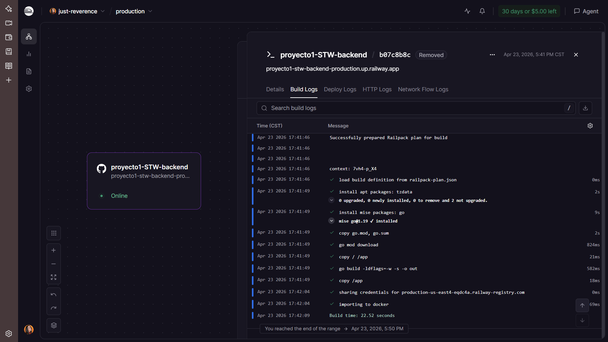

# Series Tracker — Backend

API REST para un tracker personal de series, hecha con Go y SQLite.

**Frontend:** [proyecto1-STW-frontend](https://github.com/Lazaroo1/proyecto1-STW-frontend)  
**API en producción:** https://proyecto1-stw-backend-production.up.railway.app   
 **Documentación (Swagger UI):** https://proyecto1-stw-backend-production.up.railway.app/docs  

## Screenshot



## Cómo correr localmente

```bash
git clone https://github.com/Lazaroo1/proyecto1-STW-backend
cd proyecto1-STW-backend
go mod tidy
go run .
```

El servidor corre en `http://localhost:8080`.

## Estructura del proyecto

```
.
├── main.go              # Entry point
├── db.go                # Inicialización de SQLite
├── swagger.yaml         # Spec OpenAPI
├── Dockerfile           # Para deploy en Railway
├── handlers/
│   ├── series.go        # Endpoints de series y ratings
│   └── swagger.go       # Sirve Swagger UI y swagger.yaml
├── middleware/
│   └── cors.go          # CORS headers
└── models/
    └── series.go        # Structs de Series y SeriesWithRating
```

## Endpoints

| Método | Ruta | Descripción |
|---|---|---|
| GET | `/series` | Listar series (soporta `?q=`, `?sort=`, `?order=`, `?page=`, `?limit=`) |
| GET | `/series/:id` | Obtener una serie |
| POST | `/series` | Crear serie |
| PUT | `/series/:id` | Editar serie |
| DELETE | `/series/:id` | Eliminar serie |
| GET | `/series/:id/rating` | Obtener rating |
| POST | `/series/:id/rating` | Asignar rating (0–10) |
| GET | `/docs` | Swagger UI |

## CORS

CORS (Cross-Origin Resource Sharing) es una política de seguridad del navegador que bloquea peticiones entre distintos orígenes. Se configuró `Access-Control-Allow-Origin: *` para permitir cualquier cliente durante desarrollo y producción.

## Challenges implementados

| Challenge | Puntos |
|---|---|
| Spec de OpenAPI/Swagger | 20 |
| Swagger UI servido desde el backend | 20 |
| Códigos HTTP correctos (201, 204, 404, 400) | 20 |
| Validación server-side con errores en JSON | 20 |
| Paginación con `?page=` y `?limit=` | 30 |
| Búsqueda por nombre con `?q=` | 15 |
| Ordenamiento con `?sort=` y `?order=` | 15 |
| Sistema de rating con tabla propia en SQLite | 30 |
| **Total** | **170** |

## Reflexión

Usar Go con `net/http` estándar fue una experiencia muy diferente al Lab 5 donde construíamos el servidor TCP a mano. Tener un router real simplificó enormemente el manejo de rutas y métodos HTTP. SQLite sigue siendo mi opción favorita para proyectos pequeños por lo simple que es de configurar — cero infraestructura. El mayor reto fue el deploy en Railway con `go-sqlite3`, que requiere CGO y no compilaba en su entorno por defecto. La solución con Dockerfile fue limpia y la volvería a usar sin dudarlo.
